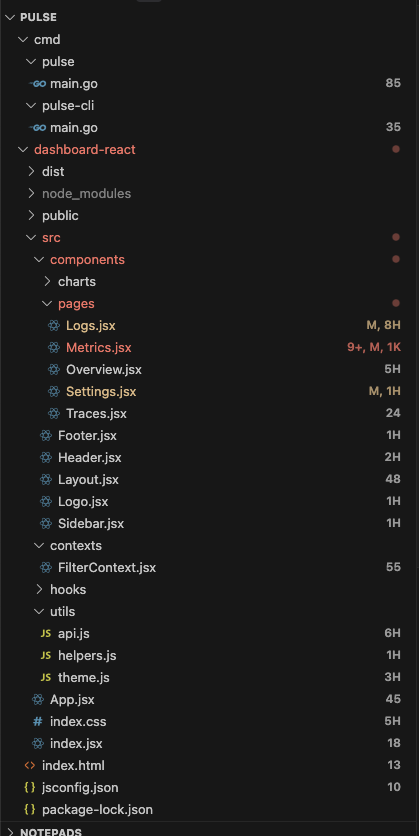

# LineSight

LineSight is a VS Code extension that shows the number of lines next to each file in the file explorer, helping you quickly understand the size of files in your project.

## Features

- **Line Count Badges**: Shows the number of lines next to each file in the explorer
- **Auto-Updates**: Line counts automatically update when files are edited
- **Refresh Button**: Provides a refresh button in the explorer title bar to manually update counts
- **Abbreviated Display**: Shows abbreviated counts (like "2k" for 2000 lines) as badges
- **Exact Counts in Tooltips**: Hover over a badge to see the exact line count
- **Skip Large Directories**: Ignores directories like node_modules and .git for better performance
- **Optimized Performance**: Minimal background overhead with smart caching and throttling

## Screenshot

## Usage

Once installed, LineSight will automatically display line counts next to your files in the explorer panel.

- **Refresh Counts**: Click the refresh icon in the explorer title bar to manually refresh line counts
- **View Exact Count**: Hover over a line count badge to see the exact number of lines in the tooltip

## Performance Considerations

- For very large files (over 5MB), line counts are estimated based on file size
- Certain directories are skipped by default to improve performance: node_modules, .git, dist, build, out
- The extension uses smart caching to minimize CPU usage
- File watchers are limited to common code file types to reduce overhead
- Updates are debounced and throttled to prevent performance impact

## Installation

1. Install the extension from the VS Code Marketplace
2. Restart VS Code
3. Line counts will automatically appear next to files in the explorer

## Extension Settings

This extension has no configurable settings at this time.

## License

This extension is licensed under the MIT License. 